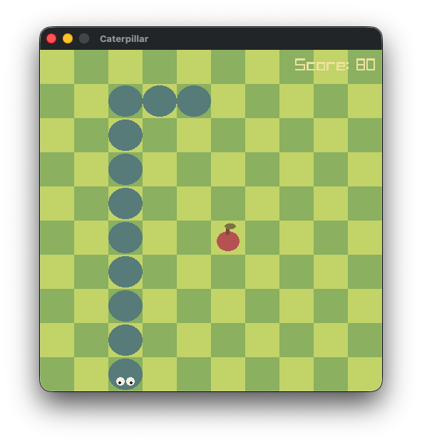

# Caterpillar Game

A simple snake-like game made with Zig and Raylib. Built as a learning project for Zig.



## Gameplay

Move the caterpillar with arrow keys, WASD, or Vim keys (hjkl). Eat apples to grow and avoid biting yourself. Fill the grid to win!

**Controls:**

- Arrow keys, WASD, or hjkl to move
- ESC to pause

## Building

Requires **Zig v0.15**

```
zig build
```

## License

GPLv3

## Credits

**Audio:**

- Game Over: [Alphix](https://pixabay.com/users/alphix-52619918/) (Pixabay)
- Win: [Sophia Conçeição](https://pixabay.com/users/superpuyofãns1234-45913026/) (Pixabay)
- Apple Bite: [bunny_cube98](https://pixabay.com/users/bunny_cube98-49455455/) (Pixabay)
- Self Bite: [freesound_community](https://pixabay.com/users/freesound_community-46691455/) (Pixabay)
- Background Music: [Suno AI](https://suno.com)
